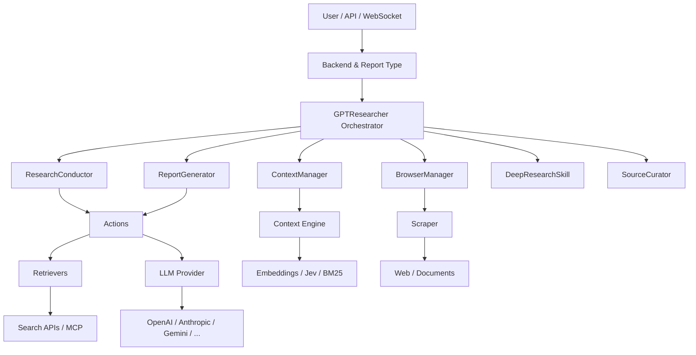
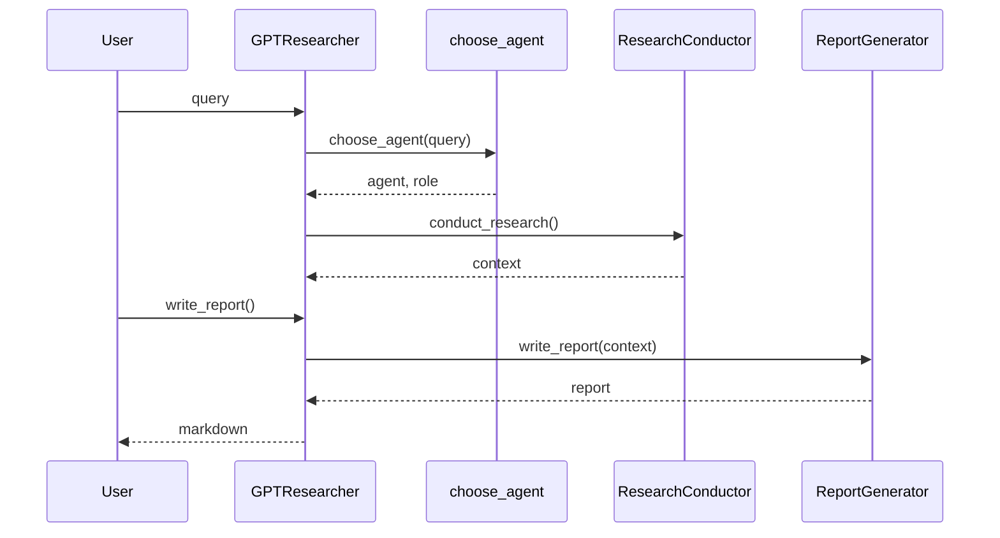

# 01 - 架构总览：GPT Researcher 到底由哪些层组成

> **本章目标**：建立全局架构图，理解 `GPTResearcher` 为什么只是入口而不是全部 Agent 逻辑，并明确 Skills、Actions、Providers、Retrievers、Scrapers、Context 与 Backend 的边界。

## 1.1 六层架构

可以把当前实现抽象成六层：



### Layer 1：Backend / Delivery

典型入口：

- FastAPI REST
- WebSocket
- `BasicReport`
- `DetailedReport`
- Multi-Agent route

它回答的是：“用户请求怎样进入研究核心，结果怎样流回前端？”

### Layer 2：Orchestrator

`gpt_researcher/agent.py::GPTResearcher`。

职责：

- 保存 Query、Report Type、Source、Tone、Context 等 session state；
- 加载 Config；
- 初始化 Retriever；
- 组装各 Skill；
- 选择普通 / Deep Research 路径；
- 统计 cost；
- 暴露统一 API。

它是典型 **Facade + Dependency Container + Session State Holder**。

### Layer 3：Skills

Skills 是“领域能力”：

| Skill | 职责 |
|---|---|
| `ResearchConductor` | 研究规划、检索、抓取、聚合 |
| `ContextManager` | Context retrieval / compression |
| `BrowserManager` | URL 抓取和图片抽取 |
| `ReportGenerator` | 报告写作 |
| `DeepResearchSkill` | 递归探索 |
| `SourceCurator` | 来源筛选与排序 |
| `ImageGenerator` | 报告插图 |

这里是业务语义最强的一层。

### Layer 4：Actions

Actions 更像细粒度 use case / functional service：

- `choose_agent`
- `generate_sub_queries`
- `get_search_results`
- `generate_report`
- Markdown processing
- scraping helpers

Skill 通常把多个 Action 串成工作流。

### Layer 5：Provider / Adapter

包括：

- LLM Provider
- Retriever
- Scraper
- Vector Store
- MCP

这一层的目标是把“供应商差异”隔离到核心流程之外。

### Layer 6：External Systems

真正产生副作用：

- OpenAI / Anthropic / Google 等 LLM API
- Tavily / Google / Bing / Exa 等 Search API
- MCP Server
- 网站
- 本地文档
- Vector DB

## 1.2 核心对象关系

`GPTResearcher.__init__` 里最值得看的不是几十个参数，而是下面这些依赖：

```python
self.research_conductor = ResearchConductor(self)
self.report_generator = ReportGenerator(self)
self.context_manager = ContextManager(self)
self.scraper_manager = BrowserManager(self)
self.source_curator = SourceCurator(self)

if report_type == ReportType.DeepResearch.value:
    self.deep_researcher = DeepResearchSkill(self)
```

注意所有 Skill 都拿到 parent `researcher`，而不是只注入自己所需的最小依赖。

优点：

- 写起来简单；
- Skill 可以访问统一状态；
- 新功能接入成本低。

代价：

- Skill 与 `GPTResearcher` 强耦合；
- 隐式依赖多；
- 单元测试要构造较重的 fake researcher；
- 状态边界不够严格。

这是面试中很适合讨论的 trade-off。

## 1.3 GPTResearcher 保存了哪些状态

可以分四类：

### 请求配置

```text
query
report_type
report_source
report_format
tone
query_domains
source_urls
document_urls
headers
```

### 研究状态

```text
context
research_sources
research_images
visited_urls
subtopics
parent_query
agent
role
```

### 基础设施

```text
cfg
retrievers
memory
vector_store
websocket
log_handler
prompt_family
```

### 成本与执行状态

```text
research_costs
step_costs
_current_step
mcp_strategy
_mcp configs
_research_id
```

这说明它不只是一个 stateless service，而是**单次研究 session 的状态容器**。

## 1.4 为什么 agent / role 分开

`choose_agent` 返回：

```text
(server, agent_role_prompt)
```

当前名字里的 `server` 容易让人误解，它本质上用于描述一个任务相关 Agent 身份；`role` 则是后续 system prompt 的核心。

例如财经研究和医学研究需要不同的：

- 关注维度；
- 证据要求；
- 语言风格；
- 风险意识。

因此角色生成属于**任务级 prompt specialization**。

## 1.5 普通模式的控制流



外层非常简单，复杂度全部被分解到了研究内部。

## 1.6 ResearchConductor 内部的结构

`ResearchConductor` 是普通模式真正的“心脏”。

```text
conduct_research
│
├── source routing
│   ├── source_urls
│   ├── Web
│   ├── Local
│   ├── Hybrid
│   ├── Azure
│   ├── LangChainDocuments
│   └── LangChainVectorStore
│
├── _get_context_by_web_search
│   ├── MCP strategy
│   ├── initial search
│   ├── plan_research
│   ├── asyncio.gather(sub_queries)
│   └── aggregate
│
└── optional source curation
```

也就是说，“Source Type”不是在 Retriever 层解决，而是在 Conductor 层做一级路由。

## 1.7 Web / Local / Hybrid 为什么能复用一套链路

一个很实用的设计是：

> 不管数据来自网页还是本地文档，最终都尽量转换为“可供 Context Manager 选择的 document/page”。

Hybrid 模式甚至会：

```python
docs_context, web_context = await asyncio.gather(
    docs_pass,
    web_pass,
)
```

然后再用 Prompt Family 合并。

这体现了一个 Agent 工程原则：

> **把多源数据尽早归一化，避免后续每一层都写 if source == xxx。**

## 1.8 Actions 与 Skills 的边界

可以用一句话区分：

- **Action**：一个具体动作；
- **Skill**：为了完成业务目标，组合多个 Action 的能力。

例如：

```text
generate_sub_queries         Action
get_search_results           Action
scrape_urls                  Action

ResearchConductor            Skill
  └── planning + search + scrape + context + aggregate
```

这种分层比所有逻辑堆在 `agent.py` 更适合长期扩展。

## 1.9 Provider 抽象

LLM 统一入口：

```text
create_chat_completion()
    ↓
get_llm(provider)
    ↓
GenericLLMProvider.from_provider()
    ↓
LangChain provider adapter
```

Retriever：

```text
get_retrievers()
    ↓
get_retriever(name)
    ↓
TavilySearch / GoogleSearch / MCPRetriever / ...
```

这种 Adapter/Factory 结构让核心 workflow 不需要知道 API SDK 的差异。

## 1.10 插件化 Retriever

当前代码除了内置 Retriever，还支持 Python entry point：

```text
gpt_researcher.retrievers
```

未知 name 会尝试加载第三方 entry point。

这是一个非常值得模仿的可扩展设计：核心仓库不必为了每个搜索 Provider 不停加 hard dependency。

## 1.11 配置层

配置优先级可以理解为：

```text
DEFAULT_CONFIG
   ↓ merge
config JSON
   ↓ override
environment variables
```

环境变量优先级最高。

而请求级参数又可以进一步覆盖实例行为，比如：

- `mcp_strategy`
- headers 中的 retriever
- `max_search_results` wrapper override

因此完整配置不是单一文件，而是多层 override。

## 1.12 架构模式总结

| 模式 | 落点 | 价值 |
|---|---|---|
| Facade | `GPTResearcher` | 给外部稳定 API |
| Orchestrator | `ResearchConductor` | 固化 Research workflow |
| Strategy | Context Filter / MCP strategy | 可切换算法 |
| Factory | Retriever / LLM | Provider 解耦 |
| Adapter | 各 Provider/Retriever | 统一接口 |
| Template/Prompt Family | `PromptFamily` | 可替换提示词体系 |
| Composite Workflow | Detailed / Deep Research | 组合多个 Researcher |
| Lazy Initialization | `memory` | 不需要 embedding 时不加载 |
| Graceful Degradation | context/LLM/retriever | 部分失败仍可运行 |

## 1.13 一个需要警惕的架构点

`GPTResearcher` 参数很多，而且 Skills 通过 parent researcher 获取几乎所有状态。这会造成“God Object”倾向。

如果做自己的生产版本，可以考虑拆成：

```text
ResearchRequest
ResearchState
ResearchConfig
ResearchServices
ResearchOrchestrator
```

让状态、配置、基础设施和行为分离。

## 1.14 本章面试题

**Q：GPT Researcher 为什么不把所有逻辑写在 Agent 类里？**

A：它把 session orchestration 放在 GPTResearcher，把领域流程拆到 Skills，把细粒度动作拆到 Actions，把外部供应商差异放到 Adapter/Provider。这样控制流、业务能力和基础设施可以独立演进。

**Q：它属于 Agent 还是 Workflow？**

A：更准确地说，是一个带 LLM 决策节点的 Agentic Workflow。普通模式的路径由代码控制，LLM 负责角色、规划和生成；Deep Research 增加递归自治，但仍有 breadth/depth/concurrency 约束。

**Q：你最想重构什么？**

A：减少 Skill 对 parent researcher 的隐式依赖，引入显式 State / Services 数据结构；同时把每个 stage 标准化为可 trace、可 replay 的节点。
