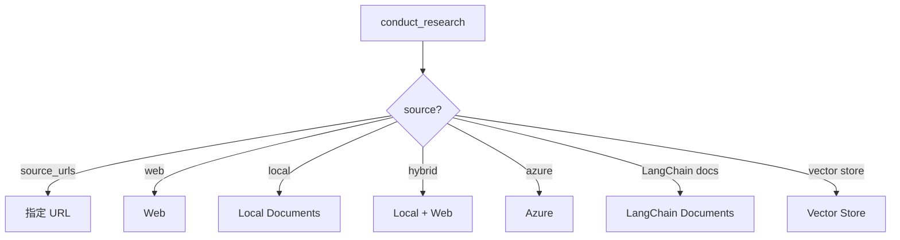
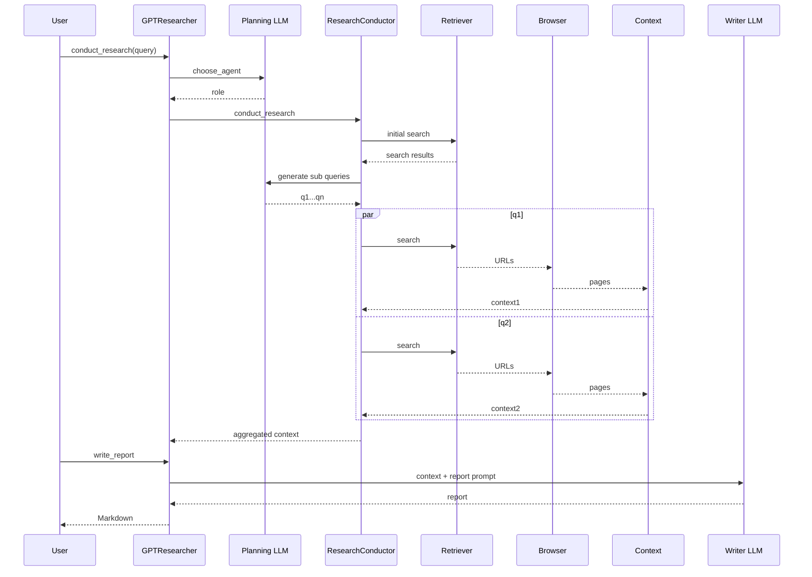

# 02 - 主链路：一次 Research 是怎样跑完的

> **本章目标**：从用户请求开始，沿实际函数调用走到最终报告。读完后应该能在白板上画出完整时序图。

## 2.1 最小入口

最小 SDK 使用本质上只有：

```python
researcher = GPTResearcher(query=query)
context = await researcher.conduct_research()
report = await researcher.write_report()
```

Backend 的 `BasicReport.run()` 也几乎就是这两步：

```text
BasicReport.run
├── GPTResearcher.conduct_research
└── GPTResearcher.write_report
```

这给我们一个非常清晰的生命周期边界：

1. **Research Phase**：从世界收集证据，构造 context；
2. **Writing Phase**：只基于研究上下文写报告。

这种分离很重要，因为它让：

- Research 可以单独复用；
- Writer 可以替换；
- Context 可以被外部传入；
- Debug 时能分清“找错了”还是“写错了”。

## 2.2 初始化阶段

`GPTResearcher.__init__` 会做：

```text
load Config
→ normalize request parameters
→ build prompt family
→ process MCP configs
→ build retrievers
→ initialize skills
→ resolve MCP strategy
```

其中几个容易忽略的细节：

### Memory 是 lazy 的

```python
@property
def memory(self):
    if self._memory is None:
        self._memory = Memory(...)
    return self._memory
```

原因：默认 context filter 可能走 keyword，根本不需要 embedding model。如果一初始化 Researcher 就强制创建 Embedding，会平白增加依赖、Key 要求和启动成本。

### visited_urls 可以来自父 Researcher

```python
self.visited_urls = visited_urls if visited_urls is not None else set()
```

Detailed Report / Deep Research 都可能共享它，用来跨子任务去重。

## 2.3 conduct_research 的一级路由

```text
GPTResearcher.conduct_research
│
├── report_type == deep_research ?
│     └── _handle_deep_research
│
├── agent / role already exists ?
│     └── no → choose_agent
│
├── ResearchConductor.conduct_research
│
└── optional ImageGenerator
```

普通模式和 Deep 模式在这里分叉。

## 2.4 第一步：选择 Agent Role

如果调用方没有显式提供 `agent` 和 `role`：

```python
self.agent, self.role = await choose_agent(...)
```

这里不是创建 Python Agent 对象，而是让 LLM 根据任务返回一个研究身份和 role prompt。

它属于“**Prompt 编排阶段**”，不是 tool execution。

## 2.5 第二步：ResearchConductor source routing

进入 `ResearchConductor.conduct_research` 后，先根据输入来源选择研究路径：



最核心的是 Web 路径。

## 2.6 Web 路径完整展开

```text
_get_context_by_web_search(query)
│
├── 1. resolve MCP strategy
│
├── 2. _get_initial_search_results(query)
│
├── 3. plan_research(query, search_results)
│      └── Strategic LLM → sub_queries
│
├── 4. append original query
│
├── 5. preserve initial planning sources
│
├── 6. asyncio.gather(
│      _process_sub_query(q1),
│      _process_sub_query(q2),
│      ...
│   )
│
└── 7. join non-empty context
```

这就是普通模式最重要的“Agent Loop”。

它不是 while，而是一个**Plan → Fan-out → Gather** 模式。

## 2.7 为什么先 Initial Search 再 Planning

`_get_initial_search_results` 先用第一个 Retriever 搜一次。

然后：

```text
query
+ initial search results
+ agent role
+ parent query
+ report type
→ plan_research_outline
→ generate_sub_queries
```

相比只把用户 Query 发给模型，Planning 得到了一些外部事实。

这降低：

- 模型把错误前提继续拆解；
- 过度依赖参数记忆；
- 完全错过近期术语/实体。

可以把它理解成轻量级 **grounded planning**。

## 2.8 Sub-query 的并发执行

核心：

```python
context = await asyncio.gather(
    *[
        self._process_sub_query(sub_query, ...)
        for sub_query in sub_queries
    ]
)
```

这说明 Research 的主要并发单位是 **sub-query**。

如果 4 个 Sub-query 串行，每个搜索 + 抓取 3 秒，延迟接近 12 秒以上；fan-out 后理论上接近最慢分支。

但也带来：

- API 并发压力；
- 对共享 `visited_urls` 的并发访问；
- MCP cache race；
- Scraper worker 限制问题。

项目针对 MCP cache 明确加了 `asyncio.Lock`。

## 2.9 一个 Sub-query 内发生什么

`_process_sub_query`：

```text
Sub Query
│
├── MCP context
│   ├── disabled → skip
│   ├── fast     → reuse cached main-query MCP results
│   └── deep     → execute MCP for this sub-query
│
├── Web path
│   ├── search relevant URLs
│   ├── dedup visited URLs
│   ├── scrape URLs
│   └── merge prefetched full content
│
├── ContextManager
│   └── select relevant content
│
└── combine MCP + Web context
```

## 2.10 Search Result 并不等于 Page Content

`_search_relevant_source_urls` 会根据 Retriever 的 `requires_scraping` 契约判断：

- `True`：搜索结果只是 preview，必须抓网页；
- `False`：Retriever 已经给了正文，可以直接使用；
- 未声明：兼容旧逻辑，用内容长度 heuristic。

这解决一个非常真实的问题：

> 一个搜索 Provider 返回 500 字 snippet，不代表它就是网页正文。

如果误判，就会把 snippet 当 source，信息残缺且引用质量下降。

## 2.11 URL 去重

`_get_new_urls`：

```text
if url not in visited_urls:
    visited_urls.add(url)
    new_urls.append(url)
```

注意是**在抓取前就加入 visited**。

目标是防止不同 Sub-query 重复抓同一 URL。

父子 Researcher 共享 visited set 时，还能跨子任务去重。

## 2.12 Browser / Scraper

新 URL 进入：

```text
BrowserManager.browse_urls
→ scrape_urls
→ Scraper.run
→ add_research_sources
→ image extraction
```

`BrowserManager` 自己持有 `WorkerPool`：

```text
MAX_SCRAPER_WORKERS = 15 (current default)
SCRAPER_RATE_LIMIT_DELAY = 0
```

这是第二层并发控制：外面 Sub-query 并发，里面 Scraper 还有 worker pool。

## 2.13 Context selection

抓取结果不会全塞给 Writer。

```text
scraped_content
→ ContextManager.get_similar_content_by_query
→ select_context
→ relevant context
```

这一步决定：

- token 成本；
- 证据密度；
- hallucination 风险；
- 报告质量。

详见第 06 章。

## 2.14 Context 聚合

每个 sub-query 返回 string context。

上层：

```text
initial_context
+ sub_context_1
+ sub_context_2
+ ...
→ " ".join(...)
```

这是一个相对简单的 aggregation，优点是透明；缺点是缺少更强的全局去重、信息冲突合并和 evidence graph。

这也是很好的二次开发点。

## 2.15 Optional Source Curation

如果 `CURATE_SOURCES=True`：

```text
raw research context
→ SourceCurator
→ LLM rank / curate
→ normalized context
```

默认关闭，意味着“可信度判断”不是所有运行都必经的 expensive LLM stage。

## 2.16 Research 完成后的图片阶段

如果启用了 Image Generator：

```text
context
→ plan visual concepts
→ generate images
→ available_images
```

注意它发生在 write report **之前**，这样 Writer 可以把已生成图片嵌进对应章节。

## 2.17 写作阶段

`GPTResearcher.write_report`：

```text
context
→ ReportGenerator.write_report
→ generate_report
→ Prompt by report type
→ smart LLM
→ markdown
```

Writer 不重新做网络研究。

这是 Research / Synthesis separation。

## 2.18 空 Context 的安全行为

`ReportGenerator.write_report` 有一个很关键的 guard：

如果 Context 是空的，不会让模型凭记忆写一篇“看起来有来源”的研究报告，而是返回“没有获取到 source material，无法可靠生成”。

这是典型的 **abstention policy**。

在生产级 Research Agent 中，这比“永远给用户答案”更重要。

## 2.19 整体时序图



## 2.20 这条链路最值得借鉴的设计

1. **Research 和 Writing 分离**
2. **Planning 有初始外部信息**
3. **Sub-query 并发 fan-out**
4. **Search / Scrape / Context 三层分离**
5. **外部 Provider 统一适配**
6. **visited URL 去重**
7. **部分失败允许继续**
8. **空证据时拒绝伪造报告**

## 2.21 面试复述模板

> GPT Researcher 的普通研究链路是一个 Plan-Fanout-Gather-Synthesize workflow。外层 GPTResearcher 保存研究 session 状态并选择 role，ResearchConductor 先做 initial search，再用 strategic LLM 生成 sub-queries，然后 asyncio.gather 并发处理每个子查询。每条分支先经过 Retriever 找候选源，再根据 content contract 判断是否需要 Scraper，之后 ContextManager 做 lexical/Jev/embedding 等相关性筛选。各分支 context 聚合后交给 ReportGenerator，由 smart LLM 生成最终报告。系统通过 visited URL、MCP cache、fallback、retry 和空 context abstention 控制成本与可靠性。
