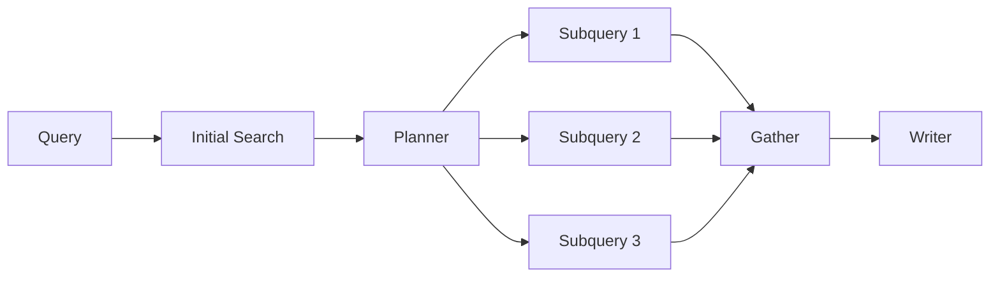

# 14 - 架构评价：GPT Researcher、Claude Code 与 Nanobot 有什么本质不同

> **本章目标**：不要只会描述源码，还要能解释“为什么这种 Agent 架构适合 Research”。本章参考 how-claude-code-works 和 learn-nanobot 的分析方式，但比较的是机制，不照搬其结论。

## 14.1 三种 Agent 不是一类产品

先给一个高层对比：

| 维度 | GPT Researcher | Claude Code 类 Coding Agent | Nanobot 类通用 Agent |
|---|---|---|---|
| 任务域 | Research | Coding / Computer Use | 通用助手 |
| 主控制流 | 显式 Research Workflow | 模型驱动 Tool Loop | ReAct Tool Loop |
| LLM 每轮选工具 | 不是主模式 | 是 | 是 |
| Query decomposition | 强 | 任务计划可有 | 可有 |
| Search/Scrape | 一等公民 | 工具之一 | 工具之一 |
| Context 核心 | Evidence selection | Conversation/tool history | Memory + tool history |
| 子 Agent | Detailed/Deep worker | Task/Subagent | Spawn/Subagent |
| 停止 | Workflow 完成 / depth | 模型停止 + max turns | 模型停止 + max iterations |
| 输出 | Research report | Code/change/result | Chat/task result |

结论：

> “Agent”不是一种固定 while-loop；不同 domain 需要不同 control policy。

## 14.2 Claude Code / Nanobot 的典型 Agent Loop

抽象：

```text
messages
→ LLM
→ tool calls?
   ├── yes → execute tools → append observations → loop
   └── no  → final
```

模型每轮都可以重新决定下一步。

优点：

- 灵活；
- 未知任务也能处理；
- Tool composition 强。

缺点：

- turn 数不可预测；
- tool selection 可能失误；
- 成本/延迟波动；
- 更依赖上下文压缩；
- 需要权限系统。

## 14.3 GPT Researcher 的普通 Loop

```text
choose role
→ initial search
→ plan queries
→ fixed research worker pipeline
→ aggregate
→ write
```

模型不能在每个页面抓完后突然决定“现在执行 shell”。

工具空间被领域 workflow 限制。

优点：

- 可预测；
- 易并发；
- 易做 eval；
- search/scrape contract 稳定；
- 成本上界更容易估。

缺点：

- 灵活性低；
- 新 research behavior 要改代码；
- 普通模式 evidence-driven replanning 弱。

## 14.4 这是一种“有限自治”

可以把 Agent 自治程度看成光谱：

```text
Pure Workflow
    |
GPT Researcher Basic
    |
GPT Researcher Deep
    |
ReAct Agent
    |
Open-ended Computer Agent
```

GPT Researcher 把自治集中在：

- role；
- planning；
- evidence extraction；
- report synthesis；
- recursive follow-up。

其余尽量由 deterministic code 控制。

## 14.5 为什么 Research 特别适合显式 Workflow

Research 的核心步骤高度重复：

```text
form question
find sources
read sources
filter evidence
synthesize
cite
```

不像 coding task 可能突然需要：

- grep；
- edit；
- run test；
- inspect browser；
- install package；
- read logs。

所以 Research 更适合把 tool orchestration 固化。

## 14.6 Context Engineering 的差异

### Coding Agent

Context 主要是：

```text
conversation
files
tool outputs
git diff
memory
```

难点是长期会话压缩、工具结果裁剪、缓存。

### GPT Researcher

Context 主要是：

```text
external evidence
search result
web pages
document chunks
previous written sections
```

难点是 relevance、provenance、source diversity 和 citation。

因此同样叫 “context management”，实现重点完全不同。

## 14.7 Tool System 的差异

Claude Code / Nanobot：

```text
Tool Registry
→ model emits tool call
→ executor
```

GPT Researcher：

```text
Workflow code
→ Retriever Adapter
→ Scraper Adapter
→ Context Strategy
```

MCP 是例外：内部可能含 tool selection，但对外又被包装成 Retriever。

## 14.8 Memory 的差异

Nanobot 这类助手强调：

- MEMORY；
- HISTORY；
- long-lived user/session memory。

GPT Researcher 核心更强调：

- current research context；
- visited URLs；
- previous written sections；
- vector store / embeddings。

它不是一个长期陪伴型 Agent，因此“长期记忆”不是主心骨。

## 14.9 Subagent 的差异

### 通用 Agent Subagent

通常：

> 主 Agent 把一个任务交给子 Agent，子 Agent 可以自由工具调用。

### Detailed Report

> 主 Researcher 按 subtopic 创建 child researcher，child 仍执行固定 research pipeline。

### Deep Research

> 树形 branch 每个节点创建 nested researcher，再由 learnings 生成下一层。

GPT Researcher 的 child 更像 **specialized worker instance**。

## 14.10 Multi-Agent 目录是另一种答案

上游还有独立 `multi_agents/`。

`ChiefEditorAgent` 使用 LangGraph `StateGraph`，并组织：

- Researcher
- Writer
- Reviewer
- Reviser
- Fact Checker
- Publisher
- Human
- Visualizer

这套架构把角色显式分开，通过图状态流转。

与核心 GPTResearcher 相比：

```text
Core:
few coarse Skills + deterministic workflow

Multi-Agent:
many role agents + graph routing/review cycles
```

它适合更强的审稿流程，但复杂度更高。

## 14.11 为什么核心项目仍保留单 Researcher 路线

Multi-Agent 不天然更好。

它会增加：

- LLM calls；
- state schema；
- routing；
- failure points；
- latency；
- observability complexity。

如果 Basic Research 已能达到目标，额外 Agent 只是在堆复杂度。

这是求职面试很重要的判断：

> **Agent 数量不是架构先进性的指标。**

## 14.12 设计模式评价

### 做得好的

**1. Domain workflow 清晰**  
Research pipeline 与业务目标高度匹配。

**2. Provider 解耦**  
Retriever / LLM / Scraper / Context Filter 都可替换。

**3. Graceful degradation**  
高级能力失败回落到本地 lexical。

**4. Reuse by composition**  
Deep/Detailed 直接创建 GPTResearcher 复用普通链路。

**5. Parallelism at natural boundary**  
Sub-query 天然适合 fan-out。

### 可以改的

**1. GPTResearcher 偏 God Object**  
Skills 依赖整个 parent。

**2. Context 类型不够统一**  
string/list/dict 兼容逻辑很多。

**3. Provenance 不够结构化**  
证据→claim 映射弱。

**4. Budget 不够统一**  
nested worker 成本/并发需要共享治理。

**5. 普通模式 replanning 弱**  
一次 Plan 后基本固定执行。

## 14.13 为什么大量 guard 是好信号

初学者看到：

```text
if not isinstance(...)
get(...) or ...
try json_repair
fallback...
```

可能觉得代码“不优雅”。

但在 Agent 工程里，它们往往来自真实 production failure：

- LLM 漂；
- Provider 漂；
- 网站漂；
- SDK 漂。

真正的问题不是 guard 多，而是有没有把它们逐渐收敛到统一 schema boundary。

## 14.14 如果重新设计一版 v2

我会保留：

```text
Plan → Retrieve → Read → Select → Synthesize
```

但引入：

```text
ResearchRequest
ResearchState
EvidenceStore
SharedBudget
StageExecutor
TraceContext
```

每个 stage：

```python
async def run(input, state, services) -> StageResult
```

并保证：

- typed result；
- trace span；
- deadline；
- retry policy；
- cost reservation；
- provenance。

## 14.15 Agent Workflow 与 DAG

普通 Research 可以明确建模：



这样一看，它更像动态 DAG 而不是聊天循环。

Deep Research 则是在运行时不断扩展 DAG。

## 14.16 面试题

**Q：GPT Researcher 和 ReAct 最大区别？**

A：ReAct 每轮由模型决定 Tool 和是否继续；GPT Researcher 普通模式由代码固定 Research pipeline，模型只在高层规划和生成节点决策。它是 domain-specific agentic workflow。

**Q：为什么不全部改成 Multi-Agent？**

A：多角色能增加 review specialization，但也显著增加 cost、latency、routing 和 state complexity。应由任务质量需求决定，不应把 Agent 数当 KPI。

**Q：从 Claude Code 文档最值得迁移什么思想？**

A：不是迁移 Coding Tools，而是迁移“明确主循环、状态边界、上下文预算、工具/副作用、恢复路径和可观测性”的分析方法。
