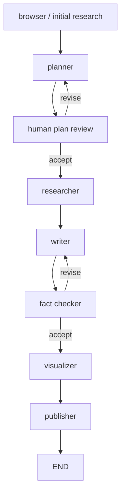
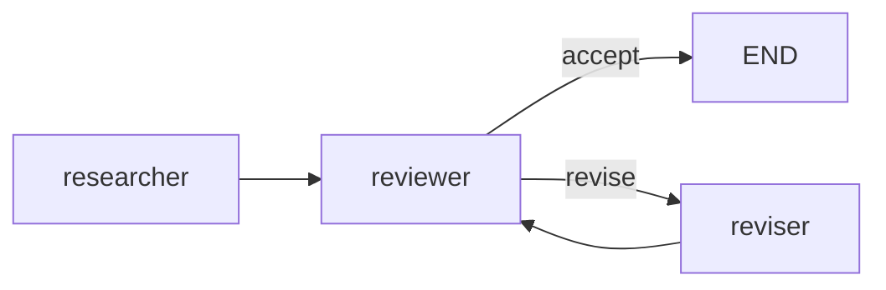

# 18 - Multi-Agent LangGraph：Chief Editor、Researcher、Writer 与 Fact Checker

> **本章目标**：补全 GPT Researcher 上游的另一条核心执行路径 `multi_agents/`。它与 `GPTResearcher + ResearchConductor` 不是同一套主循环，而是一套由 LangGraph `StateGraph` 编排的角色化研究团队。

## 18.1 为什么要单独看这条路径

Backend 在 `report_type == "multi_agents"` 时会路由到 Multi-Agent workflow，而不是 `BasicReport` / `DetailedReport`。

入口：

```text
multi_agents/main.py
→ run_research_task
→ ChiefEditorAgent
→ run_research_task
→ LangGraph
```

因此它是“同一产品里的另一种 Agent 架构实验”。

## 18.2 ChiefEditorAgent 是图编排器

文件：

```text
multi_agents/agents/orchestrator.py
```

初始化的角色：

```text
WriterAgent
EditorAgent
ResearchAgent
PublisherAgent
HumanAgent
FactCheckerAgent
VisualizerAgent
```

它并不自己做 Search 或 Writing，而是定义：

- node；
- edge；
- conditional edge；
- revision ceiling。

这是标准 graph orchestrator。

## 18.3 顶层 StateGraph

当前图：



源码节点绑定：

```text
browser     → ResearchAgent.run_initial_research
planner     → EditorAgent.plan_research
researcher  → EditorAgent.run_parallel_research
writer      → WriterAgent.run
fact_checker→ FactCheckerAgent.run
visualizer  → VisualizerAgent.run
publisher   → PublisherAgent.run
human       → HumanAgent.review_plan
```

## 18.4 为什么叫 browser 但实际是 ResearchAgent

顶层节点名是 `browser`，绑定：

```python
agents["research"].run_initial_research
```

而 `ResearchAgent` 内部又创建核心 `GPTResearcher`：

```text
ResearchAgent
→ GPTResearcher
→ conduct_research
→ write_report
```

所以 Multi-Agent 并没有重新实现 Search/Scrape/Context；它复用单 Researcher 作为“研究能力工具”。

架构是：

```text
LangGraph role orchestration
        ↓
GPTResearcher domain worker
```

## 18.5 Initial Research

`ResearchAgent.run_initial_research`：

```text
task.query
→ GPTResearcher(query)
→ conduct_research
→ write_report
→ initial_research
```

注意这里 initial research 已经生成了一份报告式文本，再交给 Editor 做 outline。

这与核心 `ResearchConductor` 中“initial search snippets → planner”不是一回事。

## 18.6 EditorAgent：先规划 sections

`EditorAgent.plan_research` 输入：

- initial research；
- task；
- human feedback；
- max sections。

调用 model 返回：

```json
{
  "title": "...",
  "date": "...",
  "sections": ["...", "..."]
}
```

它扮演“总编辑”。

## 18.7 Human-in-the-loop Plan Review

顶层图：

```text
planner
→ human
   ├── accept → researcher
   └── revise → planner
```

但 revision 不是无限。

`max_plan_revisions` 达到上限后：

```text
force accept
```

原因是避免最终撞 LangGraph recursion limit 而整个任务失败。

这是图工作流里很重要的“有界循环”。

## 18.8 Section Research 是并行的

`EditorAgent.run_parallel_research`：

```python
final_drafts = [
    chain.ainvoke(...)
    for query in queries
]

results = await asyncio.gather(*final_drafts)
```

每个 section 会启动一个内部 Draft Graph。

这与 `DetailedReport` 当前“顺序写章节”形成鲜明对比：

| 机制 | DetailedReport | Multi-Agent |
|---|---|---|
| Section execution | 顺序 | 并行 |
| 去重协作 | previous written content | sibling section hints |
| Review loop | 无独立 reviewer | reviewer/reviser |
| 优先目标 | 跨章节一致性 | 延迟 + 分工 + review |

## 18.9 sibling_sections：并行写作下的去重策略

并行意味着 section A 看不到 section B 的成稿。

于是每个 task 输入：

```text
sibling_sections = all other section names
```

`ResearchAgent.run_subtopic_research` 把它们转换为：

```text
existing_headers:
[
  {
    "subtopic task": "...",
    "note": "covered by another section of this report"
  }
]
```

再传给 `GPTResearcher.write_report`。

这种方法比真正读取其它章节弱，但允许并发。

这是一个非常清晰的 trade-off：

> **DetailedReport 用顺序依赖换一致性；Multi-Agent 用静态 sibling boundary 换并发。**

## 18.10 每个 Section 还有一个内部 Graph

`EditorAgent._create_workflow`：



节点：

```text
researcher → ResearchAgent.run_depth_research
reviewer   → ReviewerAgent.run
reviser    → ReviserAgent.run
```

也就是说 Multi-Agent 是**嵌套 Graph**：

```text
Top-level report graph
└── per-section draft graph
```

## 18.11 Draft Review 也是有界循环

`max_draft_revisions` 达到阈值：

```text
force accept
```

否则：

```text
reviewer
→ reviser
→ reviewer
```

Agent 系统里任何反思/修订 loop 都必须有 stop condition。

## 18.12 WriterAgent

顶层 Writer 主要根据所有 `research_data` 生成：

- table of contents；
- introduction；
- conclusion；
- sources；
- headers。

它不是重新写所有子章节，而是在已有 section draft 基础上补全整体结构。

如果有 fact checker notes，Prompt 要求修订 introduction/conclusion。

## 18.13 Fact Checker Loop

顶层：

```text
writer
→ fact_checker
   ├── accept → visualizer
   └── revise → writer
```

同样受 `max_fact_check_revisions` 限制。

这使最终 Writer 可以根据 fact check notes 再跑一轮。

这是核心 Basic/Detailed 路线中没有独立拆出的 review role。

## 18.14 Publisher / Visualizer

最后：

```text
fact checker accepted
→ visualizer
→ publisher
→ END
```

说明 Multi-Agent workflow 不只做 research，还负责最终 artifact assembly。

## 18.15 ResearchState 与 DraftState

LangGraph 的关键不是“多个类”，而是**共享状态 schema**。

顶层用：

```text
ResearchState
```

section 子图用：

```text
DraftState
```

每个 Node 接 state，返回部分 state 更新。

这比核心 `GPTResearcher` 的 mutable object state 更显式。

## 18.16 与 GPTResearcher Core 的状态设计对比

### Core

```text
researcher.context
researcher.visited_urls
researcher.role
...
```

OOP mutable state。

### LangGraph

```text
state dict/schema
→ node
→ state update
```

数据流更容易画图、checkpoint 和 trace，但框架依赖更重。

## 18.17 为什么 Multi-Agent 更容易做 Human-in-the-loop

因为 plan review 本来就是 graph node：

```text
planner → human → route
```

等待人类反馈是一个显式状态转移。

在普通线性 workflow 中要额外实现 pause/resume state machine。

这正是 LangGraph 这类图框架的强项。

## 18.18 Multi-Agent 的成本

粗略调用面：

```text
initial GPTResearcher
+ planner
+ N × section GPTResearcher
+ N × reviewer/reviser loops
+ top writer
+ fact checker / rewrite loop
+ visualization/publisher
```

质量可能更高，但显然比 Basic Report 昂贵。

所以一定需要 revision ceiling。

## 18.19 Multi-Agent 的 Failure Surface

更多节点意味着更多：

- Model JSON parse error；
- State key 缺失；
- graph route bug；
- section failure；
- reviewer loop；
- cost explosion。

上游有专门 `test_multi_agents_route_bindings.py`，就是在验证 route/node 绑定。

## 18.20 LangSmith / Monocle

`multi_agents/main.py` 支持：

- `LANGCHAIN_API_KEY` → LangSmith tracing；
- `MONOCLE_TRACING` → Monocle telemetry。

因为图越复杂，越需要 observability。

## 18.21 Core / Detailed / Deep / Multi-Agent 总对比

| 模式 | 核心控制结构 | 主要目的 |
|---|---|---|
| Basic | Plan-Fanout-Gather | 快速可靠研究 |
| Detailed | 顺序 Subtopic workers | 长报告一致性 |
| Deep | 递归 Search Tree | 证据深度 |
| Multi-Agent | LangGraph role/review loops | 角色分工 + 审核 |

这四条路径是理解整个项目的最终框架。

## 18.22 面试题

**Q：Multi-Agent 是否完全替代 GPTResearcher？**

A：没有。ResearchAgent 内部仍直接创建 GPTResearcher 完成具体研究。LangGraph 主要负责编排 Editor/Researcher/Writer/Reviewer/FactChecker 等角色。

**Q：为什么 section research 并发，而 DetailedReport 顺序？**

A：Multi-Agent 用 sibling section 名称告诉每个并行 worker 不要侵占其它章节；DetailedReport 则让后一个 section 直接看到前面已写内容，质量协调更强但延迟更高。

**Q：为什么 revision loop 要 force accept？**

A：否则模型可能持续给 revise，最终撞 graph recursion limit。生产 Agent 的反思 loop 必须有显式上限或 budget。
